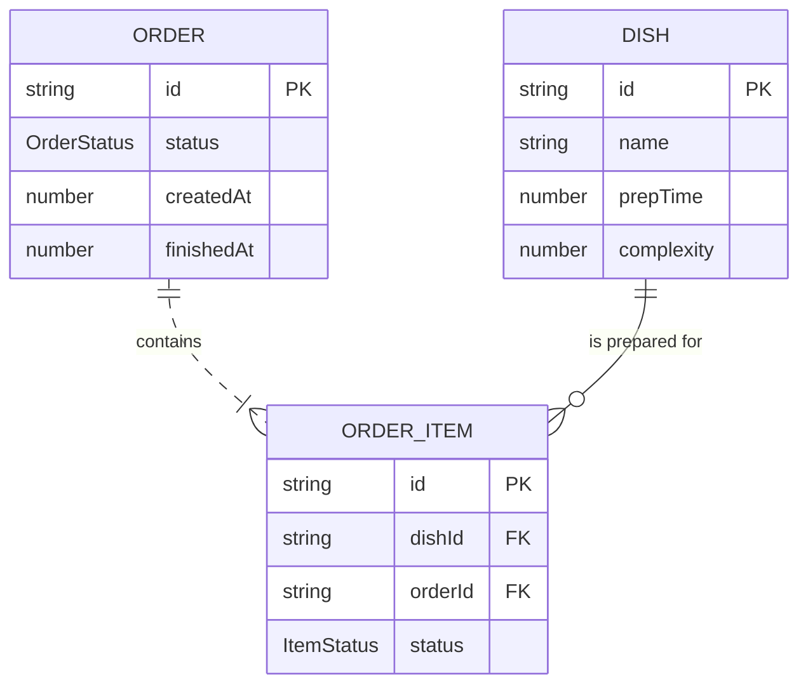

# 🍳 Kitchen Simulation App

**A simplified frontend-only restaurant-kitchen simulator built with **[**Next.js 14**](https://nextjs.org/)** and TypeScript.**

> Developed by **Musa Macheke powered by Black Technology IT Solutions** (Reg 2023/636734/07).

---

## ✨ Objective

The Kitchen Simulation App was developed to simulate basic operations in a restaurant kitchen. It focused on modeling real-world kitchen processes such as receiving orders, cooking dishes, and serving them, using clear and maintainable code.

---

## 📋 Core Features

- **Pre-defined menu** – name, preparation time (sec), and complexity (1-3).
- **Order system** allowing multiple dishes per order.
- **Kitchen queue** that processes orders in FIFO order.
- **Asynchronous preparation** using Web Workers (each representing a chef).
- **Real-time status tracking**: *Pending → Preparing → Completed*.
- **Dish-ready notifications** (console + toast): `Dish "Pizza" from Order #3 is ready`.
- **Order completion time** logged.

### Enhancements Implemented

- Multiple chefs (configurable).
- VIP priority queue (orders marked VIP skip the FIFO line).
- Local Storage persistence (state survives page refresh).

---

## 🛠️ Tech Stack

| Layer       | Tech                                            |
| ----------- | ----------------------------------------------- |
|  Front-end  | Next.js 14 (App Router) · React 18 · TypeScript |
| State       | React Context + useReducer                      |
| Styling     | Tailwind CSS · shadcn/ui                        |
| Concurrency | Browser Web Workers                             |
| Testing     | Vitest + React Testing Library                  |
| Lint/Format | ESLint · Prettier · Husky (pre-commit)          |

> 📌 Note: This is a **frontend-only - Web-UI** application with no backend.

---

## 🚀 Getting Started

### How to Run Locally

To run the application locally:

1. Ensure you have [Node.js](https://nodejs.org/) (v20 or higher) and Yarn or npm installed.
2. Clone the repository:

```bash
git clone https://github.com/MusaMacheke/Kitchen_Simulation_App.git
cd Kitchen_Simulation_App
```

3. Install dependencies:

```bash
npm install       # or yarn install   # or npm install --legacy-peer-deps
```

4. Start the development server:

```bash
npm run dev       # or yarn dev
```

5. Open your browser and navigate to `http://localhost:3000`.

### Prerequisites

```bash
# Package manager
yarn --version  # ≥ 1.22
# or
npm --version   # ≥ 10
```

### Installation & Run (Dev)

```bash
# Clone repository
$ git clone https://github.com/MusaMacheke/Kitchen_Simulation_App.git && cd Kitchen_Simulation_App

# Install dependencies
$ npm install   # or yarn install   # or npm install --legacy-peer-deps

# Start dev server
$ npm run dev   # or yarn dev       # Visit http://localhost:3000
```

### Production Build

```bash
$ yarn build     # or npm run build
$ yarn start     # or npm run start    # Launch frontend in production mode
```

### Tests & Linting

```bash
$ npm run test      # or yarn test      # Run unit and integration tests
$ npm run lint      # or yarn lint      # Run ESLint checks
```

---

## 📂 Project Structure

```
.
├─ app/                               # Next.js App Router
│  ├─ layout.tsx                      # Home (order interface)
│  └─ page.tsx                        # main page view
├─ components/                        # Reusable UI components
│  ├─ ui/                             # TypeScript models
│  ├─ chef-management.tsx
│  ├─ kitchen-dashboard.tsx           
│  ├─ order-form.tsx
│  └─ real-time-timer.tsx          
├─ lib/                               # lib folder
│  ├─ data.ts                         
│  ├─ types.ts                        
│  └─ utils.ts
└─ public/                            # Static assets
```

---

## 🧠 Domain Model (simplified)



---

## 🤔 Assumptions

- Each *chef* prepares exactly one dish at a time.
- Prep time begins **only when a chef starts working** on a dish.
- All durations are in seconds.
- Notifications are dispatched via `Web UI` and in-app toasts.
- VIP orders are flagged and given **queue priority**.

---

## ➕ Additional Features

- **Per-dish and per-order progress indicators**.
- **Responsive design** (mobile → desktop)

---

## 🛣️ Roadmap / Future Enhancements

- Backend integration (e.g., Supabase or Firebase).
- Manual drag-and-drop order prioritization.
- Chef performance analytics dashboard.
- Internationalization (i18n).

---

## 🤝 Contributing

1. Fork the repository
2. Create a feature branch (`feat/your-feature`)
3. Commit your changes
4. Open a Pull Request

---

## 📄 License

MIT — see `LICENSE` file for details.

---

## 📬 Contact

**Musa Macheke**\
Reg No: 2023/636734/07\
☎ +27 64 066 8708\
✉️ [musamacheke.01@gmail.com](mailto:musamacheke.01@gmail.com)

Built with ❤️ in South Africa.
